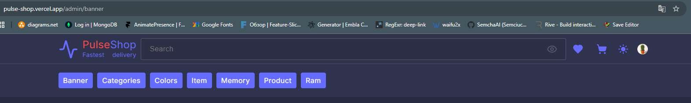
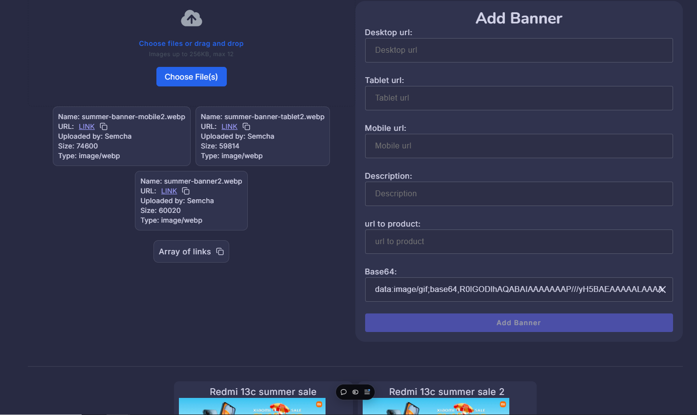
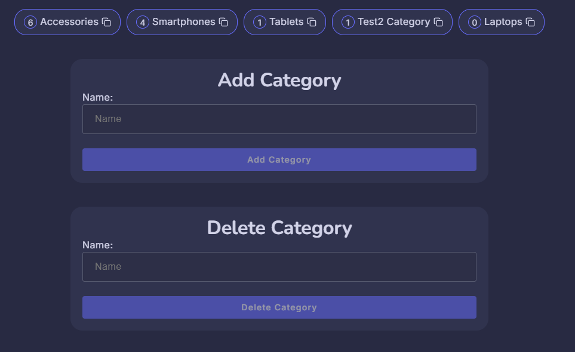
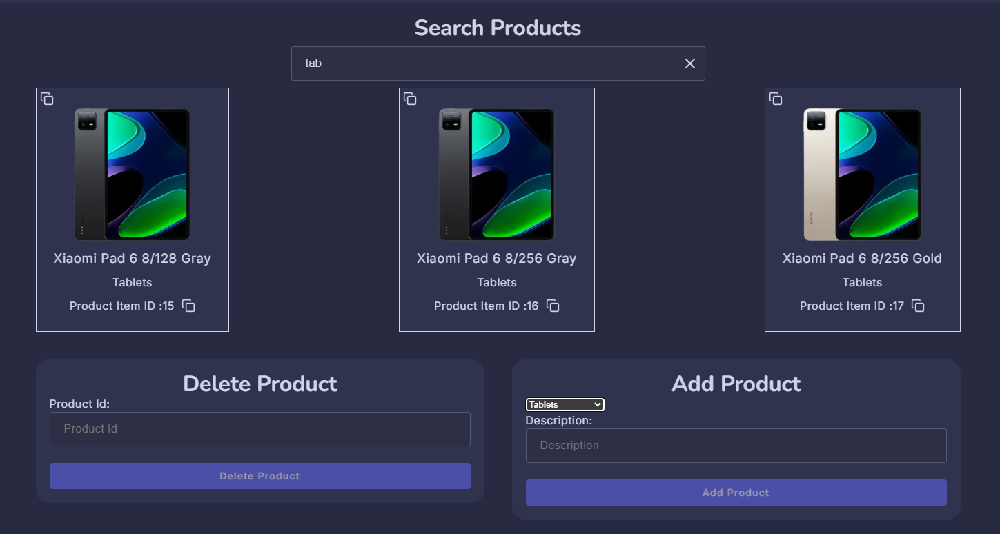
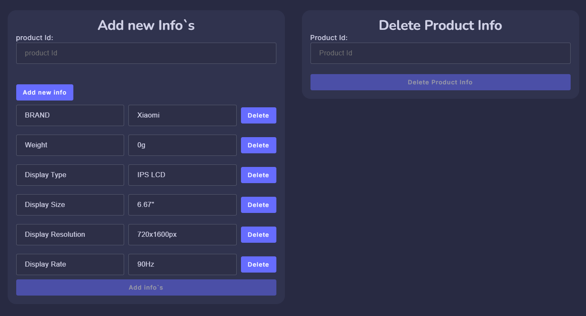
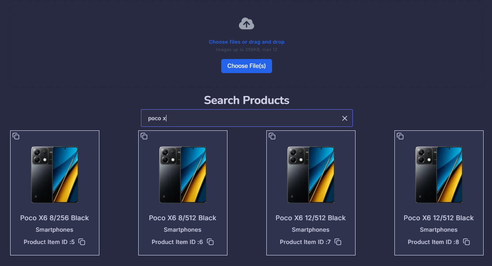
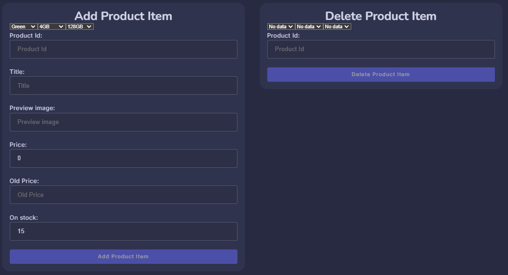
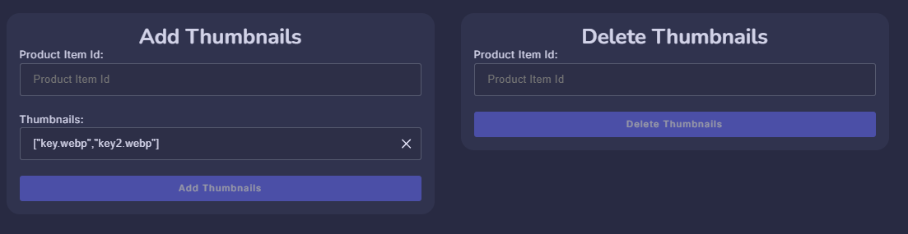

## Admin panel view

Navigation for admin.

Possibility to add and delete banner slides, with preview.

Categories controls (color, memory, ram the same)

Controls for product (main idea is that we have product and this product have different items(variations))

The information in this implementation is part of the product.

Product item controls.
Search for correctly delete any item.
Possibility to add images to server with getting back urls to correct add it into forms.

Add/delete product item

Add/delete thumbnails

